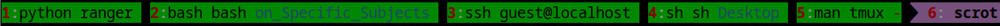

# Tmux Configuration

To cut screenshot:

```
$ convert tmux_1.png -crop 1259x33+0+970 tmux_1c.png
```

Current window status format (magenta):

```
setw -g window-status-current-format "#[fg=black]$separator_powerline_right #[fg=red,bold]#I#[fg=white]: #[default]\
#{?#{==:#{pane_current_command},ssh},\
ssh SOME REMOTE,\
#{pane_current_command}: #[fg=blue]#{=-20:#{b:pane_current_path}}}\
#[fg=brown]#F"
```

Let's assume that we have an instance of tmux server running with one session:
```
$ pstree `pgrep "tmux.*server"`
tmux: server─┬─zsh                 # window 1, ZSH, directory: ~/Desktop
             ├─zsh───bash          # window 2, BASH, directory: ~/Classes/Documents_on_Specific_Subjects
             ├─zsh───ssh           # window 3, SSH session guest@localhost, local directory: ~/Desktop (not at remote server)
             ├─zsh───sh            # window 4, SH, directory: ~/Desktop
             ├─zsh───man─┬─less    # window 5, "man tmux" command, directory: ~/Desktop
             │           └─man
             └─zsh                 # window 6, ZSH, directory: /home
```

Window status format (green):
```
setw -g window-status-format "#[fg=red,bold]#I#[fg=white]: #[default]\
#{pane_current_command}\
#[fg=brown]#F"
```


```
setw -g window-status-format "#[fg=red,bold]#I#[fg=white]: #[default]\
#{pane_current_command}: #[fg=blue]#{=-20:#{b:pane_current_path}}\
#[fg=brown]#F"
```


```
setw -g window-status-format "#[fg=red,bold]#I#[fg=white]: #[default]\
#{?#{==:#{pane_current_command},ssh},\
ssh SOME REMOTE,\
#{pane_current_command}: #[fg=blue]#{=-20:#{b:pane_current_path}}}\
#[fg=brown]#F"
```


If we want to add directory name to the name of the command only if the command is ZSH, then we can use:

```
setw -g window-status-format "#[fg=red,bold]#I#[fg=white]:#[default]\
#{?#{==:#{pane_current_command},ssh},\
ssh SOME REMOTE,\
#{?#{==:#{pane_current_command},zsh},\
ZSH: #[fg=blue]#{=-20:#{b:pane_current_path}},\
#{pane_current_command}}}\
#[fg=brown]#F"
```


Instead of if-then-else statement, we can use matching by a regular expression.
For example, we want do display directory name if the executed command is SH, BASH or ZSH:

```
setw -g window-status-format "#[fg=red,bold]#I#[fg=white]:#[default]\
#{?#{==:#{pane_current_command},ssh},\
ssh SOME REMOTE,\
#{?#{m/ri:(ba|z|^)sh,#{pane_current_command}},\
#{pane_current_command}: #[fg=blue]#{=-20:#{b:pane_current_path}},\
#{pane_current_command} }}\
#[fg=brown]#F"
```


Now let's fix the display of SSH. Suppose that we have a running SSH session:
```
$ ps aux | sed -n "1p;/ssh /p"
USER         PID %CPU %MEM    VSZ   RSS TTY      STAT START   TIME COMMAND
johndoe   435239  0.0  0.0  14068  8080 pts/3    S+   11:25   0:00 ssh guest@localhost
```

The variable `#{pane_current_command}` displays only the main executable of a running process, i.e. `ssh`.
Command arguments are not shown.

If we want to show also the user name and the host name of the session, we need to display all arguments.
Built-in functionality of `#{pane_current_command}` is not enough.
We need to query the process information from the process ID of the pane (i.e. `#{pane_pid}`).
How can we learn the running command from the process ID? It's easy:

```
$ ps -f -o "cmd"  --no-headers -p 435239
ssh guest@localhost
```

Now we want to highlight only SSH tabs by using bold red font.
The pseudocode looks like this:
```
if current_command is SSH then:
   display in red bold font SSH session info
else:
   if current_command matches BASH, ZSH or SH then:
       display in default font current_command and print in blue color last 20 characters of the current directory name
   else:
       display in default font current_command
```

The corresponding Tmux configuration is:
```
setw -g window-status-format "#[fg=red,bold]#I#[fg=white]:#[default]\
#{?#{==:#{pane_current_command},ssh},\
#[fg=red bold]#(echo `ps -f -o cmd --no-headers --ppid #{pane_pid}`),\
#{?#{m/ri:(ba|z|^)sh,#{pane_current_command}},\
#{pane_current_command}: #[fg=blue]#{=-20:#{b:pane_current_path}},\
#{pane_current_command} }}\
#[fg=brown]#F"
```


How about open man pages?

```
setw -g window-status-format "#[fg=red,bold]#I#[fg=white]:#[default]\
#{?#{==:#{pane_current_command},ssh},\
#[fg=red bold]#(echo `ps -f -o cmd --no-headers --ppid #{pane_pid}`),\
#{?#{m/ri:(ba|z|^)sh,#{pane_current_command}},\
#{pane_current_command}: #[fg=blue]#{=-20:#{b:pane_current_path}},\
#(echo `ps -f -o cmd --no-headers --ppid #{pane_pid}`)}}\
#[fg=brown]#F"
```


Let's open console file manager `ranger` in window 1:


The window name is quite long. How do we strip unnecessary `/usr/bin/` prefix from the main executable of the process?

We have to sacrifice highlighting of `ssh` sessions for now:
```
setw -g window-status-format "#[fg=red,bold]#I#[fg=white]:#[default]\
#(curps=`ps -f -o cmd --no-headers --ppid #{pane_pid}`;\
 if [ -z $\{curps\} ]; then\
  echo -n \"#{pane_current_command}\";\
else \
  echo -n \"\$curps\";\
fi)\
#{?#{m/ri:(ba|z|^)sh,#{pane_current_command}},\
 #[fg=blue]#{=-20:#{b:pane_current_path}},\
} #[fg=brown]#F"
```


As you can see, nothing has changed except for the color of the SSH session name and an extra whitespace. Removal of conditional statement for SSH check is necesary because escaping of characters `$#{}` inside these statement apparently *does not work*.

However there is one important difference in the logic: the current command is stored in shell variable `$curps`.
It will be used in the current steps to extract substrings.


What is happening in the background? Tmux is periodically running the script responsible for window naming in the background:
```
$ pgrep -fa "curps"
600917 sh -c curps=`ps -f -o cmd --no-headers --ppid 459206`; if [ -z ${curps} ]; then  echo -n "python";else   echo -n "$curps";fi
600918 sh -c curps=`ps -f -o cmd --no-headers --ppid 459241`; if [ -z ${curps} ]; then  echo -n "bash";else   echo -n "$curps";fi
600919 sh -c curps=`ps -f -o cmd --no-headers --ppid 459265`; if [ -z ${curps} ]; then  echo -n "ssh";else   echo -n "$curps";fi
600920 sh -c curps=`ps -f -o cmd --no-headers --ppid 459297`; if [ -z ${curps} ]; then  echo -n "sh";else   echo -n "$curps";fi
```
So our BASH portion of the script runs as expected with all special characters escaped properly. We can another command to grep for `curps` variable:
```
$ ps -A  -o pid,cmd | sed -n "1p;/curps/p"
    PID CMD
 602029 sh -c curps=`ps -f -o cmd --no-headers --ppid 459206`; if [ -z ${curps} ]; then  echo -n "python";else   echo -n "$curps";fi
 602031 sh -c curps=`ps -f -o cmd --no-headers --ppid 459241`; if [ -z ${curps} ]; then  echo -n "bash";else   echo -n "$curps";fi
 602032 sh -c curps=`ps -f -o cmd --no-headers --ppid 459265`; if [ -z ${curps} ]; then  echo -n "ssh";else   echo -n "$curps";fi
 602033 sh -c curps=`ps -f -o cmd --no-headers --ppid 459297`; if [ -z ${curps} ]; then  echo -n "sh";else   echo -n "$curps";fi
```
Note that process IDs have changed since the last time.
The process tree looks like this:
```
$ pstree `pgrep "tmux.*server"`
tmux: server─┬─zsh───ranger
             ├─zsh───bash
             ├─zsh───ssh
             ├─zsh───sh
             ├─zsh───man─┬─less
             │           └─man
             └─zsh
```

Since capabilities of Tmux are limited for text proessing, we need to rely on [substring removal](https://tldp.org/LDP/abs/html/string-manipulation.html) feature of BASH/ZSH:
```
${string#substring}
    Deletes shortest match of $substring from front of $string.

${string##substring}
    Deletes longest match of $substring from front of $string.

```
Let's test it in ZSH:
```
$ a="/usr/bin/python"

$ echo ${a#p}
ython

$ echo ${a#*/}
usr/bin/python

$ echo ${a#/usr}
/bin/python

$ echo ${a##*/}
python
```

Greedy matching `##*/` captures all characters from the beginning till the last encountered slash inclusively.

Now we can try this feature in the Tmux configuration. There is one caveat though: characters `#{}` need to be escaped first.
This can be done differently: we can usee `\{...\}` instead of `{}` and `##` instead of `#`.
The dollar sign `$` needs to be escaped in order not be confused with Tmux variable (e.g. `$var`).
However, if a curly bracket is already escaped like in `$\{var\}`, then it does not need to be escaped.

This yield a structure `$\{curps####*/\}` which should be interpreted in BASH/ZSH as `${curps##*/}` and means
to remove a substring from the beginning of string `curps` (current long command name which being executed)
which matches any character including the last slash `/` encountered:

```
setw -g window-status-format "#[fg=red,bold]#I#[fg=white]:#[default]\
#(curps=`ps -f -o cmd --no-headers --ppid #{pane_pid}`;\
 if [ -z $\{curps\} ]; then\
  echo -n \"#{pane_current_command}\";\
else \
  echo -n \"$\{curps####*/\}\";\
fi)\
#{?#{m/ri:(ba|z|^)sh,#{pane_current_command}},\
 #[fg=blue]#{=-20:#{b:pane_current_path}},\
} #[fg=brown]#F"
```


It worked, but matching of characters was too greedy. The string `/usr/bin/python -O /usr/bin/ranger` was trimmed to `ranger` since the last occurence of `/` if counted from the front, is just before the letter `r`.

We need to do more sophisticated text processing.
```
$ curps="/usr/bin/python -O /usr/bin/ranger"
$ echo $curps
/usr/bin/python -O /usr/bin/ranger
```

Now let's remove a subtring starting from the end of the string till the last occurence of a whitespace inclusively:
```
$ a=${curps%% *}
$ echo $a
/usr/bin/python
```

The resulting substring may be fed into another substring removal operation: this time we can remove all characters till the last match of a slash `/`:
```
$ echo ${a##*/}
python
```

Similarly, we can extract the argument name by
  1) removing a substring from the start till the last occurence of a whitespace inclusively,
  2) removing a substring from the start till the last occurence of slash `/` from the substring in step 1:
```
$ b=${curps##* }
$ echo $b
/usr/bin/ranger

$ echo ${b##*/}
ranger
```

Note that combining operations into a single expression does not work in BASH, but works in ZSH:
```
bash-5.1.16$ echo "${${curps##* }##*/}"
bash: ${${curps##* }##*/}: bad substitution

zsh-5.9$ echo "${${curps##* }##*/}"
ranger
```

Summing up, here is the configuration with `$a` and `$b` variables:
```
setw -g window-status-format "#[fg=red,bold]#I#[fg=white]:#[default]\
#(curps=`ps -f -o cmd --no-headers --ppid #{pane_pid}`;\
 if [ -z $\{curps\} ]; then\
  echo -n \"#{pane_current_command}\";\
else \
  a=$\{curps%%%% *\};\
  b=$\{curps####* \};\
  echo -n \"$\{a####*/\} $\{b####*/\}\";\
fi)\
#{?#{m/ri:(ba|z|^)sh,#{pane_current_command}},\
 #[fg=blue]#{=-20:#{b:pane_current_path}},\
} #[fg=brown]#F"
```
which produces:



Why window number 2 (`bash`) and window number 4 (`sh`) have duplicates of the executed command? That's because `$a` and `$b` are equal.
We can add an extra check for this case:
```
setw -g window-status-format "#[fg=red,bold]#I#[fg=white]:#[default]\
#(curps=`ps -f -o cmd --no-headers --ppid #{pane_pid}`;\
 if [ -z $\{curps\} ]; then\
  echo -n \"#{pane_current_command}\";\
else \
  a=$\{curps%%%% *\};\
  b=$\{curps####* \};\
  if [ \$a = \$b ]; then \
     echo -n \"\$a\";\
  else \
     echo -n \"$\{a####*/\} $\{b####*/\}\";\
  fi;\
fi)\
#{?#{m/ri:(ba|z|^)sh,#{pane_current_command}},\
 #[fg=blue]#{=-20:#{b:pane_current_path}},\
} #[fg=brown]#F"
```
which produces:


Now highlighting SSH:
```
setw -g window-status-format "#[fg=red,bold]#I#[fg=white]:#[default]\
#(curps=`ps -f -o cmd --no-headers --ppid #{pane_pid}`;\
 if [ -z $\{curps\} ]; then\
  echo -n \"#{pane_current_command}\";\
else \
  a=$\{curps%%%% *\};\
  b=$\{curps####* \};\
  if [ \$a = \$b ]; then \
     echo -n \"\$a\";\
  else \
     if [ $\{a::3\} = 'ssh' ]; then\
         echo -n \"\#[fg=red,bold]\";\
     fi;\
     echo -n \"$\{a####*/\} $\{b####*/\}\";\
  fi;\
fi)\
#{?#{m/ri:(ba|z|^)sh,#{pane_current_command}},\
 #[fg=blue]#{=-20:#{b:pane_current_path}},\
} #[fg=brown]#F"
```


Now let's replace `/home/johndoe/` with `~/`.
We will use substring replacement in BASH:
```
${string/substring/replacement}
    Replace first match of $substring with $replacement.

${string//substring/replacement}
    Replace all matches of $substring with $replacement.
```

There are differences between BASH and ZSH:
```
$ c="/home/`whoami`/"

$ echo $c
/home/johndoe/

bash-5.1.16$ echo "${c/\/home\/`whoami`/\~}"
~/

bash-5.1.16$ echo "${c/\/home\/`whoami`/~}"
/home/johndoe/

zsh-5.9$ echo "${c/\/home\/`whoami`/\~}"
\~/

zsh-5.9$ echo "${c/\/home\/`whoami`/~}"
~/
```

In order to display directory names only for BASH, ZSH and SH shells, we need to remove the tmux's if-logic and replace it with BASH logic.
Matching of `#{pane_current_command}` with regular expression `(ba|z|^)sh` should be done in statement `if [[ "str" =~ regex ]]` .
Note that double brackets are a bashism and are not part of the POSIX standard.
```
setw -g window-status-format "#[fg=red,bold]#I#[fg=white]:#[default]\
#(curps=`ps -f -o cmd --no-headers --ppid #{pane_pid}`;\
 if [ -z $\{curps\} ]; then\
  echo -n \"#{pane_current_command}\";\
else \
  a=$\{curps%%%% *\};\
  b=$\{curps####* \};\
  if [ \$a = \$b ]; then \
     echo -n \"\$a\";\
  else \
     if [ $\{a::3\} = 'ssh' ]; then\
         echo -n \"\#[fg=color20,bold]\";\
     fi;\
     echo -n \"$\{a####*/\} $\{b####*/\}\";\
  fi;\
fi;\
if [[ \"#{pane_current_command}\" =~ (ba|z|^)sh ]]; then\
     c=#{pane_current_path};\
     echo -n \" $\{c/\\/home\\/`whoami`/\\~\}\";\
fi;\
 )\
 #[fg=brown]#F"
```


Before going forward, let's see how the BASH code above is interpreted by the operating system.
Since the code above will be concatenated into one line, we can search for the same `curps` pattern among running processes.

Argument `-o cmd=` of `ps` prints only executed command and suppresses the header.
The sed command `sed -n "1p;/curps/p;i\ "` will print the header ("1p": print first line; if a line has pattern `curps` then print it ("p;") and add an extra new line after it "i\ "):
```
$ ps -A  -o cmd= | sed -n "1p;/curps/p;i\ "
/sbin/init

sed -n 1p;/curps/p

sh -c curps=`ps -f -o cmd --no-headers --ppid 459206`; if [ -z ${curps} ]; then  echo -n "python";else   a=${curps%% *};  b=${curps##* };  if [ $a = $b ]; then      echo -n "$a";  else      if [ ${a::3} = 'ssh' ]; then         echo -n "#[fg=color20,bold]";     fi;     echo -n "${a##*/} ${b##*/}";  fi;fi;if [[ "python" =~ (ba|z|^)sh ]]; then     c=/home/johndoe/Desktop;     echo -n " ${c/\/home\/`whoami`/\~}";fi;

sh -c curps=`ps -f -o cmd --no-headers --ppid 459241`; if [ -z ${curps} ]; then  echo -n "bash";else   a=${curps%% *};  b=${curps##* };  if [ $a = $b ]; then      echo -n "$a";  else      if [ ${a::3} = 'ssh' ]; then         echo -n "#[fg=color20,bold]";     fi;     echo -n "${a##*/} ${b##*/}";  fi;fi;if [[ "bash" =~ (ba|z|^)sh ]]; then     c=/home/johndoe/Classes/Documents_on_Specific_Subjects;     echo -n " ${c/\/home\/`whoami`/\~}";fi;

sh -c curps=`ps -f -o cmd --no-headers --ppid 459265`; if [ -z ${curps} ]; then  echo -n "ssh";else   a=${curps%% *};  b=${curps##* };  if [ $a = $b ]; then      echo -n "$a";  else      if [ ${a::3} = 'ssh' ]; then         echo -n "#[fg=color20,bold]";     fi;     echo -n "${a##*/} ${b##*/}";  fi;fi;if [[ "ssh" =~ (ba|z|^)sh ]]; then     c=/home/johndoe/Desktop;     echo -n " ${c/\/home\/`whoami`/\~}";fi;
```
Try to run the command multiple times, every time the result might be different, since tmux runs window-status update script periodically, and `ps` command might not catch the expected output when needed.

So if take one example execution of the script, we can unfold it into multiple lines:
```
curps=`ps -f -o cmd --no-headers --ppid 459241`;
if [ -z ${curps} ]; then
  echo -n "bash";
else
  a=${curps%% *};  b=${curps##* };
  if [ $a = $b ]; then
      echo -n "$a";
  else
      if [ ${a::3} = 'ssh' ]; then
        echo -n "#[fg=color20,bold]";
      fi;
      echo -n "${a##*/} ${b##*/}";
  fi;
fi;

if [[ "bash" =~ (ba|z|^)sh ]]; then
    c=/home/johndoe/Classes/Documents_on_Specific_Subjects;
    echo -n " ${c/\/home\/`whoami`/\~}";
fi;
```
We can see how the escaping of special characters works in `.tmux.conf`.

Now we can shorten the long directory name:
```
setw -g window-status-format "#[fg=red,bold]#I#[fg=white]:#[default]\
#(curps=`ps -f -o cmd --no-headers --ppid #{pane_pid}`;\
 if [ -z $\{curps\} ]; then\
  echo -n \"#{pane_current_command}\";\
else \
  a=$\{curps%%%% *\};\
  b=$\{curps####* \};\
  if [ \$a = \$b ]; then \
     echo -n \"\$a\";\
  else \
     if [ $\{a::3\} = 'ssh' ]; then\
         echo -n \"\#[fg=color20,bold]\";\
     fi;\
     echo -n \"$\{a####*/\} $\{b####*/\}\";\
  fi;\
fi;\
if [[ \"#{pane_current_command}\" =~ (ba|z|^)sh ]]; then\
     c=#{pane_current_path};\
     d=\"$\{c/\\/home\\/`whoami`/\\~\}\";\
     if [ $\{##d\} -gt 20 ]; then\
         echo -n \" $\{d::8\}...$\{d: -9\}\";\
     else\
         echo -n \" $\{d\}\";\
     fi;\
fi;\
 )\
 #[fg=brown]#F"
```


Now let's move the whole logic into a separate BASH script:
```
#!/usr/bin/env bash
# Arg1: #{pane_pid}
# Arg2: #{pane_current_command}
# Arg3: #{pane_current_path}

curps=`ps -f -o cmd --no-headers --ppid $1`

if [ -z ${curps} ]; then
  echo -n "$2"
else
  a=${curps%% *}
  b=${curps##* }
  if [ $a = $b ]; then
     echo -n "$a"
  else \
     if [ ${a::3} = 'ssh' ]; then
         echo -n "#[fg=color20,bold]"
     fi
     echo -n "${a##*/} ${b##*/}"
  fi
fi

if [[ "$2" =~ (ba|z|^)sh ]]; then
  d="${3/\/home\/`whoami`/\~}"
  if [ ${#d} -gt 20 ]; then
      echo -n " ${d::8}...${d: -9}"
  else
      echo -n " ${d}"
  fi
fi
```

We can invoke it here:
```
setw -g window-status-format "#[fg=red,bold]#I#[fg=white]:#[default]\
#(get_pane_full_command \"#{pane_pid}\" \"#{pane_current_command}\" \"#{pane_current_path}\")"
```


To split a long line in a BASH script use [this method](https://stackoverflow.com/questions/7729023/how-do-i-break-up-an-extremely-long-string-literal-in-bash).